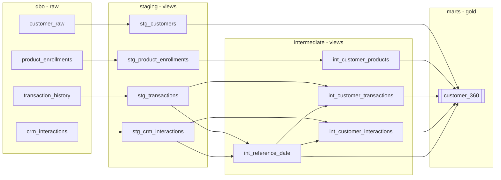

# Data Model Design and Lineage

## Layers

The warehouse lives in CaseStudyDB and is split into four layers:

| Layer | Schema | Materialized as | Purpose |
|---|---|---|---|
| Raw | dbo | tables (loaded by Python) | untouched source extracts |
| Staging | staging | views | one view per source: cleaning, renaming, typing |
| Intermediate | intermediate | views | per-customer aggregations, one topic each |
| Marts (gold) | marts | table | customer_360, one row per customer, BI-ready |

Staging and intermediate are views because they hold no state, always reflect
the latest raw data, and cost nothing to store. Only the gold table is a
physical table, since it is the reporting surface and carries the heavy joins.

Each intermediate model covers a single topic (products, transactions,
interactions). That keeps every model testable on its own at the customer
grain, and keeps the gold model down to a readable set of left joins.

## Lineage

## Grain and keys

| Model | Grain | Key |
|---|---|---|
| stg_customers | 1 row per customer | customer_id |
| stg_product_enrollments | 1 row per product account | product_id |
| stg_crm_interactions | 1 row per interaction | interaction_id |
| stg_transactions | 1 row per transaction | transaction_id |
| int_reference_date | single row | n/a |
| int_customer_* | 1 row per customer | customer_id |
| customer_360 | 1 row per customer | customer_id |

customer_360 covers every customer in customer_raw. The mart starts from the
customer table and left joins the rest, and a dedicated test checks full
coverage. Customers with no products, transactions or interactions still
appear, with zeroed metrics.

## Cleaning done in staging

| Model | Change | Reason |
|---|---|---|
| stg_customers | email lower-cased and trimmed | consistent matching and dedup detection |
| stg_customers | mobile standardized to +63 format | source mixes local (09) and international (+639) formats about 50/50 |
| stg_customers | is_duplicate_email flag added | 3 emails are shared across customers; flagged rather than dropped |
| stg_product_enrollments | limit renamed to credit_limit | limit is a reserved word, and the new name makes clear it only applies to credit cards |
| stg_transactions | transaction_direction derived | makes the sign convention explicit (negative = outflow) |

## Reporting optimization

- The gold table is a physical table with a clustered columnstore index
  (the dbt-sqlserver default), which suits the scan-and-aggregate queries
  Power BI and Tableau generate.
- A unique nonclustered index on customer_id (added by a post-hook) supports
  single-customer lookups and joins.
- All segments and flags are precomputed. BI tools filter on plain columns
  and never re-derive business logic, so every report shows the same numbers.
- 100k rows by about 45 columns fits easily in import mode for both tools.
